# Survaas

## About

This project offers a "survey-as-a-service"-solution by providing CDK code for a platform 
which lets you host online surveys in a serverlessly scalable container environment using AWS Fargate, 
store the response data in a fully managed Amazon Aurora Serverless v2 database cluster 
and analyze it from a AWS SageMaker domain according to your specific research interests.

## General Overview

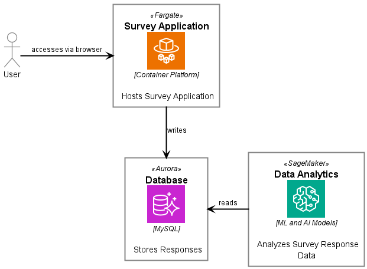

## Getting started

### Prerequisites:

1. Node Package Manager installed on your local machine
2. AWS CLI installed on your local machine (see https://docs.aws.amazon.com/cli/latest/userguide/getting-started-install.html for instructions)
3. AWS CDK installed on your local machine (see https://docs.aws.amazon.com/cdk/v2/guide/getting_started.html for instructions)
4. AWS Account which has been bootstrapped for CDK (see https://docs.aws.amazon.com/cdk/v2/guide/bootstrapping.html for instructions)
5. [Docker](https://docs.docker.com/) installed and running on your local machine

### Deploy the infrastructure to you AWS Account

1. Open AWS CLI and authenticate with an administrative user (see https://docs.aws.amazon.com/cli/latest/userguide/cli-chap-authentication.html for instructions).
2. Open a command line in the project directory.
3. Run `npm install` to install the dependencies from the package.json file.
4. Set `CDK_DEFAULT_ACCOUNT` and `CDK_DEFAULT_REGION` as environment variables for the account id and region you wish to deploy to.
5. Run `cdk deploy --all` as authenticated admin user to deploy the survaas infrastructure to your AWS account.
6. In the AWS Management Console go to CloudFormation and verify that all the stacks deployed successfully. 

### Survey environment

1. In the AWS Management Console go to EC2 and open the load balancer section.
2. Identify the loadbalancer of your survey environment.

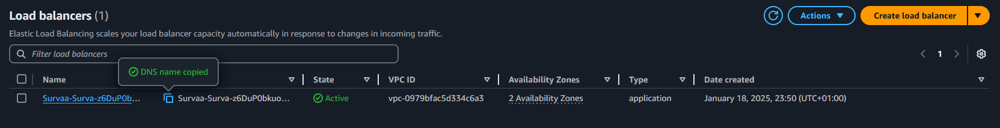

3. Copy over the loadbalancer DNS name to a new browser tab.
4. If the deployment worked as intended you should see the following screen:

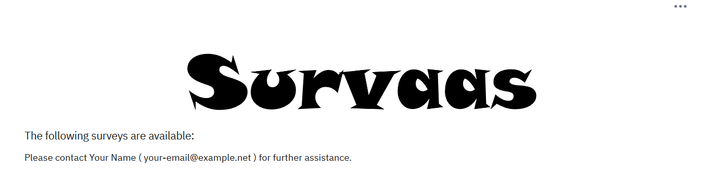

5. In your browser go to LOADBLANCER_DNS_NAME/admin. 
6. Enter the credentials for your survey application you set above. The default values are user: 'admin', password: 'password'.
7. Go to "Create survey" and choose the "Import" tab.
8. Browse into the "sampleData" folder of your local project directory, choose the "sample_survey.lss" file and upload it.

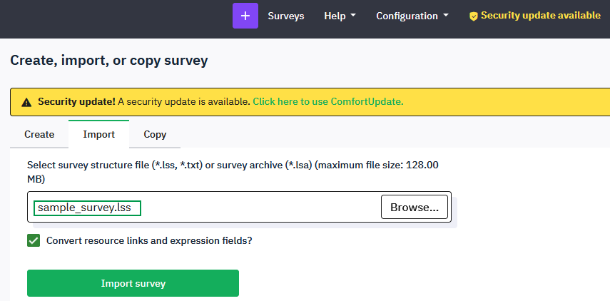

9. Click "Go to survey", choose the settings tab and go to "Overview".
10. Click on "Activate survey" and proceed.

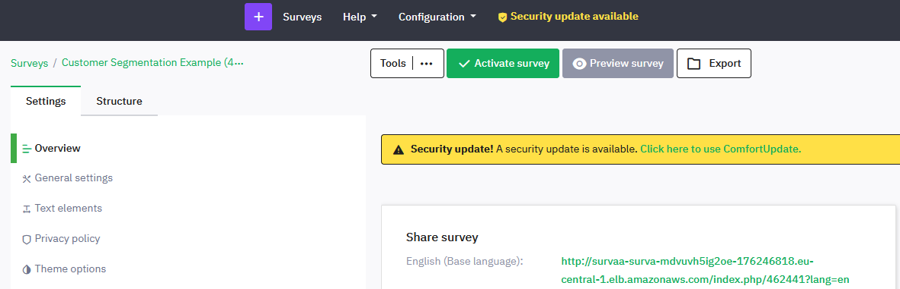

11. Open the survey URL in a new browser tab and fill in the survey if you like.

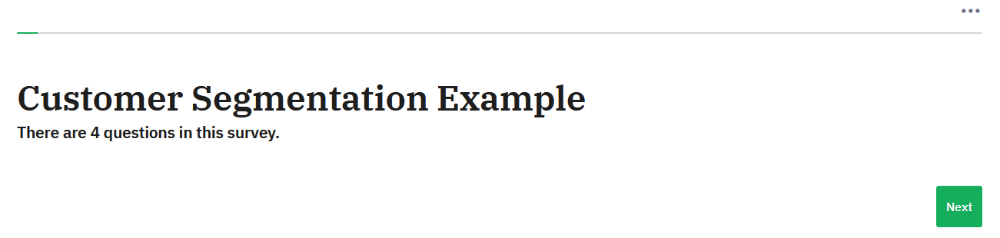

That way you can also share the surveys created by yourself.

### Analytics environment

#### Prerequisites: 

Since SageMaker in this setup is configured to authenticate with SSO you need an AWS Identity Center user 
in order to access your SageMaker domain. 
For further information see: https://docs.aws.amazon.com/singlesignon/latest/userguide/quick-start-default-idc.html.

1. In the AWS Management Console go to "Amazon SageMaker AI" and under "Domains" select your survaas domain.
2. Select the user profiles tab and assign a user to your domain.

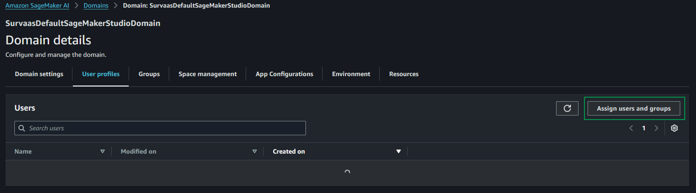

3. In the AWS access portal of the user you added select the "Applications" tab and open your survass SageMaker domain.

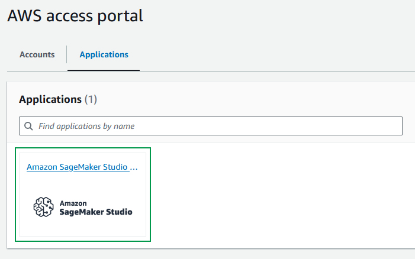

4. Go to JupyterLab and create a new space.

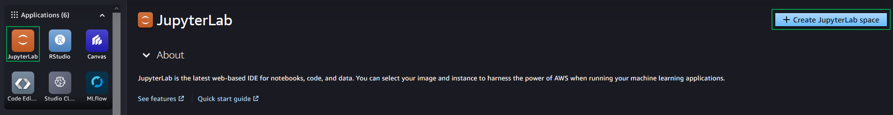

5. You can leave every option as default and just run the space.
6. Open the space (under "Settings" > "Theme" you can switch on the dark mode if you prefer).
7. Click "Upload files" on the left.
8. In your local project folder navigate to the sampleData directory and upload all the files stored in the "sagemaker" folder.
9. Open the "test_rds_connection.ipynb" Jupyter notebook. If you have left the appName of the SurvaasClusterStack as default you can just run the notebook as it is. 
Otherwise check the rds_instance_identifier, db_name and ssm_param_name at the bottom and change them according to your appName. 
How to change the appName and add new SurvaasClusterStacks is explained in the "Developer guide" section below.

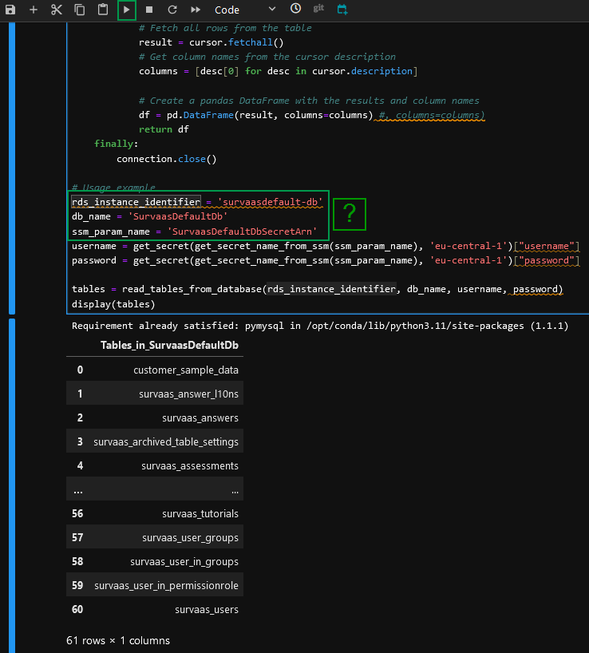

10. Open "load_data.ipynb" Jupyter notebook and check the rds_instance_identifier, db_name and ssm_param_name if you changed the appName of the SurvaasClusterStack.
11. Run all cells in order to load some sample data to your RDS database cluster. This sample data mocks a result set of the customer segmentation sample survey mentioned above.
12. Open "pca_sample.ipynb" Jupyter notebook and check the rds_instance_identifier, db_name and ssm_param_name if you changed the appName of the SurvaasClusterStack.
13. Run all cells of the notebook in order to apply a principal component analysis to the sample data set 
which groups the data into different customer types.

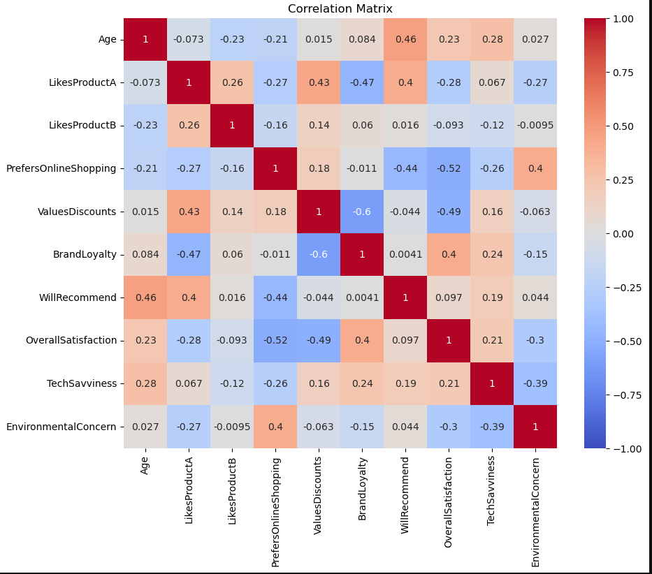

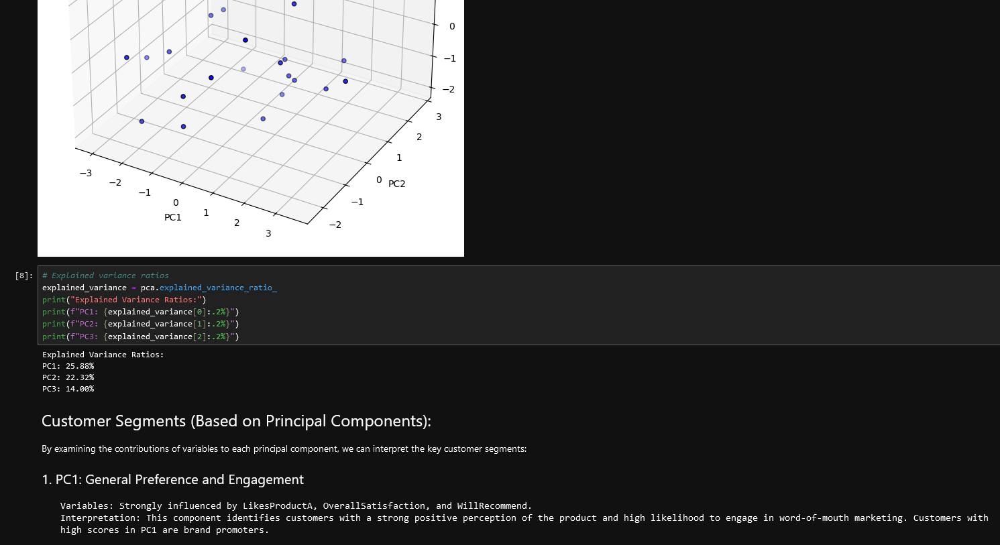

This way you can analyze the response data of your surveys. 
The default table name of your repsonse data is "survaas_survey_{SURVEY_ID}".
You get the survey id from the "surveys" section of your survaas application.

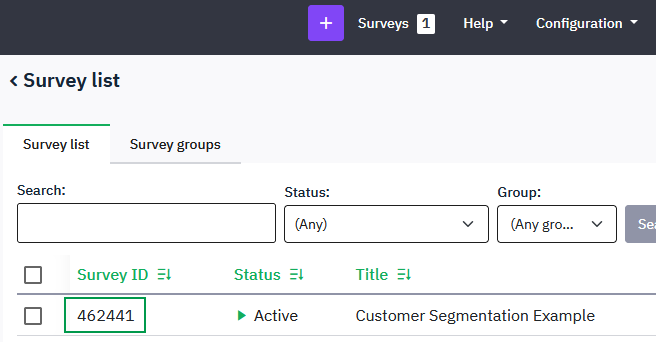

If you prefer the VS Code development experience over JupyterLab you can run your code in CodeEditor, as well.

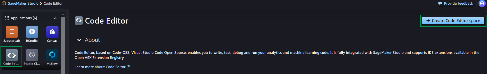

## Implementation details

### Architecture

The following diagram was automatically created by [CdkGraph](https://aws.github.io/aws-pdk/developer_guides/cdk-graph/index.html)  on `cdk synth`.

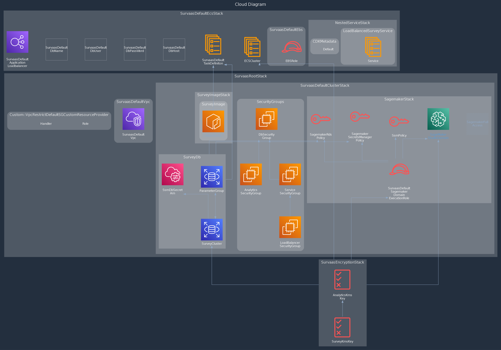

#### Application Hosting

The survey application uses a pre-built [container image](https://github.com/adamzammit/limesurvey-docker#limesurvey) 
stored in an ECR container registry and hosted on a ECS Fargate cluster.
The loadbalancer is placed in a nested stack inside of the SurveyEcsStack of the CDK application.
This way the loadbalancer can be deleted via CloudFormation without deleting the ECS cluster.
The ECS task CPU and memory is set to the minimum default values, .25 vCPU and 0.5 GB memory,
so you might want to consider increasing them in the SurveyEcsStack.
The containers share a managed EBS volume of 15 gibibytes for data persistence.
You may increase this default size there, as well.

#### Storage

The survey response data is stored in a RDS Aurora Serverless v2 cluster.
The capacity is set to 0.5 miminmum and 2 maximum ACU.
You can adjust these settings inside of the RdsStack.
The database credentials are securely stored in AWS Secrets Manager.

#### Analytics

Data can be analyzed on a SageMaker domain which has direct access to the response data in the RDS cluster.
The domain ExecutionRole uses the AmazonSageMakerFullAccess managed policy. 
You may want to restrict the permissions to meet your specific security policies.

#### Networking

Every SurvaasClusterStack is created in the same SurvaasDefaultVpc with 2 availability zones with two subnets, 
a private and a public one, respectively.
Internet access is granted by a NAT gateway placed in a public subnet with a route to an internet gateway.
For every SurvaasClusterStack there are four security groups: one for the ECS cluster, one for the loadbalancer, one for the RDS cluster 
and one for the SageMaker domain.
All of them come with appropriately restricted in- and egress rules 
in order to properly isolate them from the resources of other SurvaasClusterStacks.

#### Encryption

The response data and the data of the Sagemaker domain are encrypted with separate customer managed KMS keys.
The access permissions of the SageMaker domain ExecutionRole are granted via a corresponding IAM inline policy.

### Developer guide

#### Documentation

For a cdk stack overview see index.html in the docs folder.
You can update the typedoc documentation for your changes with `npx typedoc --plugin typedoc-plugin-missing-exports`.

#### How to add a new SurvaasClusterStack to the app?

Since Survaas is meant as a platform solution you can add complete and separate survey environments 
with their own ECR container registry, ECS cluster, RDS cluster and SageMaker domain.
In order to add a new SurvaasClusterStack go to "lib" > "root.ts" 
and initialize a new SurvaasClusterStack like the commented out lines in the picture below show.
Just fill in a unique appName and initial credentials for your survey database.

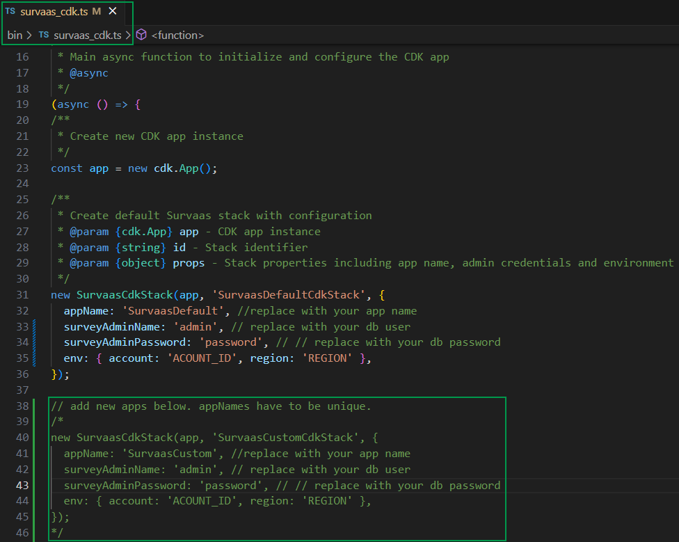

By doing so you deploy a completely new survey environment in the same SurvaasDefaultVpc
with different and isolated security groups for the ECS cluster, RDS database and SageMaker environment
encrypted by two new customer managed KMS keys.
A worthwhile future consideration might be 
to do new survey environment creation via AWS [Service Catalog](https://aws.amazon.com/servicecatalog/).

## Testing with Jest and aws-cdk-lib/assertions

This project uses Jest for testing and the `aws-cdk-lib/assertions` library to validate the CDK infrastructure. The tests verify that the infrastructure is correctly configured according to best practices and requirements.

### Running Tests

To run the tests, use the following command:

```bash
npm test
```

### Test Structure

The tests are organized by component:

1. **Main Stack Tests** (`surveyaas_cdk.test.ts` and `root.test.ts`):
   - Tests the overall SurvaasRootStack and its components
   - Verifies that all required resources are created
   - Checks that resources are properly connected

2. **VPC Tests** (`vpc.test.ts`):
   - Tests the VPC configuration
   - Verifies subnets, NAT gateway, and routing

3. **Security Group Tests** (`security-groups.test.ts`):
   - Tests security group configurations
   - Verifies proper ingress/egress rules

4. **RDS Tests** (`rds.test.ts`):
   - Tests the RDS Aurora cluster configuration
   - Verifies encryption, instances, and subnet groups

5. **ECS Tests** (`ecs.test.ts`):
   - Tests the ECS service configuration
   - Verifies task definitions, load balancer, and networking

6. **KMS Tests** (`kms.test.ts`):
   - Tests KMS key configurations
   - Verifies key policies and permissions

7. **SageMaker Tests** (`sagemaker.test.ts`):
   - Tests SageMaker domain and user profile configuration
   - Verifies IAM roles and permissions

8. **ECR Tests** (`ecr.test.ts`):
   - Tests Docker image asset creation
   - Verifies ECR repository configuration

9. **App Cluster Tests** (`app-cluster.test.ts`):
   - Tests the main application cluster stack
   - Verifies all components are properly integrated

### Testing Approach

The tests use the `aws-cdk-lib/assertions` library to:

1. Verify resource counts (`template.resourceCountIs`)
2. Check resource properties (`template.hasResourceProperties`)
3. Find specific resources (`template.findResources`)
4. Use matchers for flexible assertions (`Match.anyValue()`, `Match.objectLike()`, etc.)

### Adding New Tests

When adding new infrastructure components, follow these steps to add tests:

1. Create a new test file for the component
2. Set up the necessary constructs in the `beforeEach` block
3. Write tests that verify resource creation and configuration
4. Run the tests to ensure they pass

## Licensing and attribution

### Licensing

This repository includes code and resources that are licensed under multiple open-source licenses. Below is a summary of the licensing information:

- **docker/Docker.survey**: Licensed under [GNU General Public License version 3 (GPL-3.0)](https://www.gnu.org/licenses/gpl-3.0.html).
- **docker/docker-entrypoint.sh**: Derived from a GPL-3.0-licensed project.
- **docker/Sea_Green_custom**: Originally licensed under [GNU General Public License version 2 (GPL-2.0) or later](https://www.gnu.org/licenses/old-licenses/gpl-2.0.html). Used under the "or later" clause, permitting compatibility with GPL-3.0.
- **docker/survey_template/layout_survey_list.twig**: Originally licensed under [GNU General Public License version 2 (GPL-2.0) or later](https://www.gnu.org/licenses/old-licenses/gpl-2.0.html). Used under the "or later" clause, permitting compatibility with GPL-3.0.
- **docker/SurveyActivator.php**: Originally licensed under [GNU General Public License version 2 (GPL-2.0) or later](https://www.gnu.org/licenses/old-licenses/gpl-2.0.html). Used under the "or later" clause, permitting compatibility with GPL-3.0.

The combined work, including the container image built using these files, is distributed under the terms of [GPL-3.0](https://www.gnu.org/licenses/gpl-3.0.html).

### Attribution

The following files in this repository are derived from other open-source projects:

#### docker/Docker.survey and docker/docker-entrypoint.sh
- **Source Repository**: [adamzammit / limesurvey-docker](https://github.com/adamzammit/limesurvey-docker#limesurvey)
- **License**: GPL-3.0
- **Modifications**:
  - Added code for limesurvey trademark removal to Docker.survey file
  - Changed docker-entrypoint.sh to remove any sitename from application/config/config.php

#### docker/Sea_Green_custom (GPL-2.0 or later)
- **Source Repository**: [LimeSurvey / LimeSurvey](https://github.com/LimeSurvey/LimeSurvey)
- **License**: GPL-2.0 or later
- **Modifications**:
  - Removed LimeSurvey trademarks from default admin theme

#### docker/survey_template/layout_survey_list.twig (GPL-2.0 or later)
- **Source Repository**: [LimeSurvey / LimeSurvey](https://github.com/LimeSurvey/LimeSurvey)
- **License**: GPL-2.0 or later
- **Modifications**:
  - Removed footer from survey list layout
  - Removed header logo from survey list layout

#### docker/SurveyActivator.php (GPL-2.0 or later)
- **Source Repository**: [LimeSurvey / LimeSurvey](https://github.com/LimeSurvey/LimeSurvey)
- **License**: GPL-2.0 or later
- **Modifications**:
  - fixed bug concerning default_storage_engine after MySql update

### Notes on License Compatibility
The original files are either licensed under GPL-3.0 or GPL-2.0 including the "or later" clause, which allows their use under GPL-3.0. 
As such, all components of this project have been combined and distributed under GPL-3.0 to ensure license compatibility.

### How to Comply with the License
If you redistribute this repository or derivative works:
1. Include a copy of the GPL-3.0 license.
2. Provide attribution to the original authors of the included files.
3. Share any modifications to these files under the same license.

For more details, see the [GPL-3.0 license text](https://www.gnu.org/licenses/gpl-3.0.html).

### Note on using LimeSurvey

This project relies on LimeSurvey as web application for running online surveys.
If you deploy the architecture to your AWS account you install LimeSurvey to your Fargate containers.
LimeSurvey is open source software under the [GNU General Public License v2](https://www.gnu.de/documents/gpl-2.0.de.html), 
but comes with restrictions concerning its trademark.
So, please make sure you comply with the [LimeSurvey License & Trademark Guidelines](https://community.limesurvey.org/licence-trademark/).

## Steps towards Production

The code in this repository only outlines the raw core functionality of the application
which in the current state is far from production ready. 
This section just mentions some steps towards production readiness without any aspiration of completeness.

### From HTTP to HTTPS

Since the implementation of in transit encryption via SSL requires a web domain it hasn't been considered for the core functionality.
In order to secure the communication with your survey environment you can do the following:

1. Create a Hosted Zone in [Route 53](https://aws.amazon.com/route53/) for your domain.
2. Request a public SSL/TLS certificate in [AWS Certificate Manager](https://aws.amazon.com/certificate-manager/).
3. Add the certificate to your load balancer and define appropriate listener rules as, for example, described in [this guide](https://exanubes.com/blog/adding-ssl-certificate-to-fargate-app).

### Firewall

As your load balancer directly faces the internet you might want to add a firewall as a security layer in front of it in order to control the traffic.
You can do so by using the [AWS WAF](https://docs.aws.amazon.com/waf/latest/developerguide/what-is-aws-waf.html) service.
[This guide](https://jadhavrohit.medium.com/integrating-aws-waf-with-aws-application-load-balancer-69377f946743) may serve you well as a starting point for this purpose. 